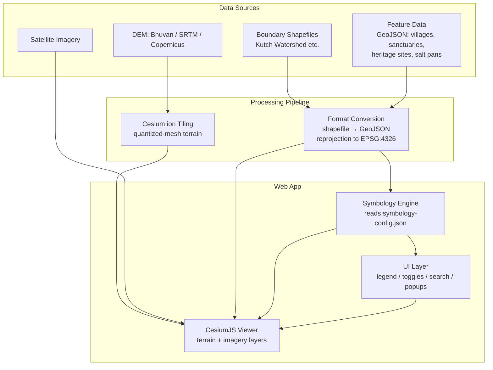

# Architecture — 3D Interactive Map of the Kutch Desert (CesiumJS)

## 1. Tech stack

| Layer | Choice | Why |
|---|---|---|
| 3D engine | **CesiumJS** | Native 3D globe, terrain meshes, GeoJSON/KML/CZML support, built-in Entity API well-suited to symbology-driven styling |
| Terrain/imagery hosting | **Cesium ion** | Handles tiling (quantized-mesh terrain, 3D Tiles) and streaming without self-hosting a tile server |
| Build tool | **Vite** | Fast dev server, clean ESM bundling for CesiumJS's asset/worker files |
| Frontend framework | **Vanilla JS/TS or React** (React only if UI complexity — legend, toggles, popups — grows large) | Keep Cesium canvas framework-agnostic; wrap UI panels separately |
| Data format for features | **GeoJSON** (source of truth), optionally converted to **CZML** for time-dynamic features later | GeoJSON is simplest to author/edit; CZML needed only for Phase 5 time-dynamic layers |
| Styling config | **JSON symbology config** (see §4) | Single source of truth mapping feature `type` → visual style |
| Hosting (app) | Netlify / Vercel / static host | CesiumJS apps are static after build; no backend required for MVP |
| Version control | Git | — |

No backend is required for the MVP (Phases 0–4). A backend only becomes necessary in Phase 5 if user-contributed data or auth is added.

---

## 2. High-level system diagram



---

## 3. Folder structure

```
kutch-3d-map/
├── public/
│   └── assets/
│       ├── icons/              # SVG/PNG symbology icons (one per feature type)
│       └── models/             # glTF models for landmark 3D objects (Phase 5)
├── src/
│   ├── main.ts                 # Cesium Viewer bootstrap
│   ├── config/
│   │   ├── camera.config.ts    # Default view, bounding box for Kutch region
│   │   ├── symbology.config.json  # type → {icon, color, scale, category}
│   │   └── layers.config.ts    # List of data sources + load order
│   ├── data/
│   │   ├── boundaries/         # GeoJSON: district, Rann boundary, watersheds
│   │   ├── features/           # GeoJSON: villages, sanctuaries, heritage, salt pans
│   │   └── raw/                # Original shapefiles/DEMs before conversion (not shipped to prod)
│   ├── modules/
│   │   ├── terrain.ts          # Terrain + imagery layer setup
│   │   ├── symbology.ts        # Reads GeoJSON + config, builds styled Entities/DataSources
│   │   ├── legend.ts           # Builds legend UI from symbology.config.json
│   │   ├── toggles.ts          # Category show/hide logic
│   │   ├── popup.ts            # InfoBox / custom popup rendering
│   │   └── search.ts           # Geocode / fly-to search
│   └── ui/
│       ├── Legend.tsx (or .ts) # Legend panel component
│       ├── LayerPanel.tsx
│       └── styles.css
├── scripts/
│   └── convert-data.py         # gdal/ogr2ogr helpers: shapefile→GeoJSON, reprojection
├── index.html
├── vite.config.ts
├── package.json
├── roadmap.md
└── architecture.md
```

---

## 4. Data model — the core of the symbology system

Every feature (point or polygon) in `src/data/features/*.geojson` follows this schema in its `properties`:

```json
{
  "id": "dholavira-001",
  "type": "heritage",
  "subtype": "archaeological-site",
  "name": "Dholavira",
  "description": "Harappan-era archaeological site...",
  "mediaUrl": "/assets/images/dholavira.jpg",
  "season": null,
  "visitInfo": {
    "openHours": "9:00–18:00",
    "entryFee": "₹40"
  }
}
```

**Rule: `type` always drives symbology.** Nothing in the rendering code should special-case an individual feature by name — styling is always looked up via `type` (and optionally `subtype` for finer variation) against the symbology config.

### `symbology.config.json` shape

```json
{
  "settlement": {
    "label": "Villages & Settlements",
    "icon": "/assets/icons/village.svg",
    "color": "#D97706",
    "scale": 0.6
  },
  "salt-pan": {
    "label": "Salt Pans",
    "icon": "/assets/icons/salt.svg",
    "color": "#E5E7EB",
    "scale": 0.6
  },
  "wildlife": {
    "label": "Wildlife & Conservation",
    "icon": "/assets/icons/wildlife.svg",
    "color": "#16A34A",
    "scale": 0.6
  },
  "heritage": {
    "label": "Cultural & Heritage Sites",
    "icon": "/assets/icons/heritage.svg",
    "color": "#7C3AED",
    "scale": 0.6
  },
  "tourism": {
    "label": "Tourism Infrastructure",
    "icon": "/assets/icons/tourism.svg",
    "color": "#DC2626",
    "scale": 0.6
  }
}
```

This file is consumed by **both** `symbology.ts` (to style entities) and `legend.ts` (to render the legend) — guaranteeing the legend always matches the map exactly, per cartography best practice.

### Loading flow (`symbology.ts`)
1. Load `symbology.config.json`.
2. For each `type` in the config, create one `Cesium.CustomDataSource` (one per category — this is what makes toggle-by-category cheap and performant).
3. Load the corresponding GeoJSON features, filter by `type`, and add each as an `Entity` to that category's DataSource with `billboard`/`point`/`polygon` styling pulled from the config.
4. Register each DataSource with the Viewer; `toggles.ts` simply flips `dataSource.show` per category — no re-querying or re-styling needed.

---

## 5. Terrain & imagery pipeline

1. **Acquire DEM** — clip to the ~20 km² White Rann study area only (no need to fetch/tile the full district). Bhuvan CartoDEM (preferred for India-specific accuracy) or SRTM 30m as fallback; note that flat alluvial/salt-flat terrain is exactly where some global DEMs (e.g. FABDEM) lose accuracy, so a visual sanity-check against known-flat ground truth matters here more than usual.
2. **Reproject** to a consistent CRS (EPSG:4326) using GDAL if not already, cropped tightly to the bounding box in §6.
3. **Upload to Cesium ion** — ion handles tiling into quantized-mesh terrain automatically; given the tiny area, tiling a custom high-res DEM here is cheap and worth doing rather than relying on coarse global terrain.
4. **Imagery** — start with a Cesium ion default imagery provider (Bing Aerial) or ESRI World Imagery; at this small scale, check available imagery resolution carefully — the visual payoff of this whole project depends on the salt-crust texture actually being visible, not a blurry mid-res satellite tile.
5. **Vertical exaggeration** — the Rann is essentially dead flat (near-zero relief), so exaggeration needs to be used deliberately and sparingly here, or skipped in favor of a **normal-map/shader-based** approach to fake subtle salt-crust micro-texture, since real elevation data at this scale will likely show almost nothing. Always provide a toggle back to 1× ("true scale") for accuracy-sensitive use.

---

## 6. Camera & scene defaults

- **Study area: ~20 km² patch of open salt flat in the White Rann, near Dhordo** (Great Rann of Kutch) — not the whole district. This is pure desert terrain: no village/tent-city structures, just salt-crust texture, flatness, and light.
  - Approx. bounding box (**unverified — confirm against satellite imagery before final tiling**):
    - North: 23.890°N
    - South: 23.850°N
    - West: 69.828°E
    - East: 69.872°E
    - Center: ~23.87°N, 69.85°E
  - Rationale: small enough to texture in real detail (individual salt-crust cracking patterns, subtle micro-relief) rather than rendering a blurry regional overview; large enough to still feel like an open, disorienting expanse when flown over.
- Default camera: fly-to this bounding box, pitched ~-30 to -45° for an oblique 3D view on load — shallower than a typical terrain demo, since the whole point of the Rann is its near-total flatness stretching to the horizon; too steep a pitch away from horizon undersells that.
- Lock minimum zoom-out so users can't accidentally fly to the whole globe on first load (`Camera.flyTo` with a fixed destination + `SceneMode` guard).
- Provide a UI button to reset to default view.
- Consider a `SceneMode.SCENE2D` / `COLUMBUS_VIEW` toggle for a "flat analysis mode" (useful given Kutch's flatness — see roadmap Phase 1 note).

---

## 7. Performance considerations

- **Batch by category, not by feature** — one `DataSource` per `type`, not per point. Cesium optimizes rendering per-collection.
- **Clustering** for dense point clusters (villages) using Cesium's built-in `EntityCluster` on each DataSource once feature count grows.
- **Lazy-load categories** — don't load "stretch" categories (e.g., time-dynamic CZML layers) until the user actively toggles them on.
- **Terrain LOD** — rely on Cesium's automatic quantized-mesh LOD; avoid forcing high detail globally, especially over the flat Rann where detail adds little visual value.
- **Icon assets** — use SVG sprites or a small PNG icon atlas rather than many separate image requests.

---

## 8. Extensibility checklist (how future "features" get added cleanly)

To add a brand-new feature category later (e.g., "flood-zone" for monsoon season):
1. Add a new entry to `symbology.config.json` (icon, color, label).
2. Add a new GeoJSON file (or extend an existing one) with `type: "flood-zone"`.
3. `symbology.ts` and `legend.ts` pick it up automatically — no code changes required in the rendering pipeline.
4. If it needs custom behavior (e.g., animated/time-based), extend `modules/` with a dedicated handler (e.g., `seasonal.ts`) rather than modifying the core symbology engine.

This is the architectural payoff of building the symbology system data-driven from Phase 3 onward: new features become **config + data changes**, not new code paths.

---

## 9. Open technical risks to flag early

- **Cesium ion free tier limits** on terrain/imagery streaming bandwidth — monitor if traffic grows.
- **DEM accuracy over alluvial/salt-flat terrain** — some DEMs (e.g., FABDEM) are known to be less accurate specifically over flat alluvial plains, which describes much of the Rann; validate against Bhuvan data if precision matters.
- **Mobile GPU performance** — CesiumJS is WebGL-heavy; test early on mid-range Android devices, not just desktop.
- **Licensing** on any third-party imagery/boundary datasets before shipping publicly.
